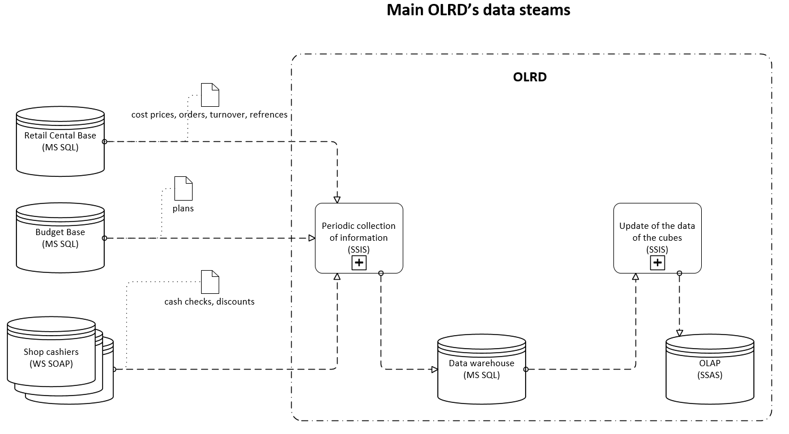
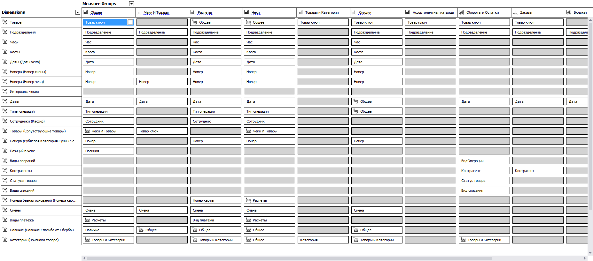

# olrd
Systems collects various retail information of a reatal network and forms it for further analysis.
Techinques used: MS SQL, MS SSIS, MS SSAS, c#.

----here will be more detail----

The olap part has a few measures groups and linked cubes:

